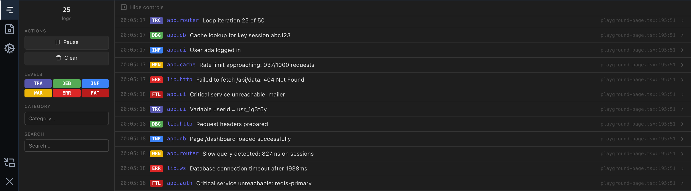

# @mugenlabs/logtape-devtools

A [TanStack DevTools](https://tanstack.com/devtools) plugin for inspecting [LogTape](https://logtape.org) logs in the browser.

Filter, search, and inspect structured logs in real time — without leaving the browser DevTools overlay.



## Features

- **Live log streaming** — see logs as they happen
- **Level filtering** — toggle trace, debug, info, warning, error, fatal
- **Category search** — filter by logger category
- **Structured inspection** — expand logs to view properties and source location
- **Pause & resume** — freeze the log stream to inspect entries
- **Bounded memory** — a ring buffer keeps a fixed number of records
- **Cheap when closed** — notifications are batched, the list is virtualized, and stack capture is skipped while no panel is subscribed

## Installation

```bash
pnpm add @mugenlabs/logtape-devtools @logtape/logtape @tanstack/react-devtools
```

## Quick Start

`createLogTapeDevtools()` returns a sink and a panel plugin already wired to the same store. This is the recommended path.

```tsx
import { configure, getLogger } from "@logtape/logtape";
import { createLogTapeDevtools } from "@mugenlabs/logtape-devtools";
import { TanStackDevtools } from "@tanstack/react-devtools";

const { sink, plugin } = createLogTapeDevtools();

await configure({
  sinks: { devtools: sink },
  loggers: [{ category: [], lowestLevel: "trace", sinks: ["devtools"] }],
});

getLogger(["app", "auth"]).info("User {username} logged in", { username: "john_doe" });

function App() {
  return (
    <>
      <YourApp />
      <TanStackDevtools plugins={[plugin]} />
    </>
  );
}
```

### Advanced: two factories with an explicit store

Use the individual factories when you need to hold on to the store — for example to clear it from a test, to run several isolated stores, or to configure LogTape in a file that must not import React.

```ts
// logging.ts
import { configure } from "@logtape/logtape";
import { createDevtoolsSink, createLogStore } from "@mugenlabs/logtape-devtools";

export const logStore = createLogStore({ maxRecords: 5000 });

await configure({
  sinks: { devtools: createDevtoolsSink({ store: logStore }) },
  loggers: [{ category: ["app"], lowestLevel: "debug", sinks: ["devtools"] }],
});
```

```tsx
// app.tsx
import { createLogTapeDevtoolsPlugin } from "@mugenlabs/logtape-devtools";
import { TanStackDevtools } from "@tanstack/react-devtools";
import { logStore } from "./logging";

const plugin = createLogTapeDevtoolsPlugin({ store: logStore });

export function App() {
  return <TanStackDevtools plugins={[plugin]} />;
}
```

The sink and the plugin must be given **the same** store instance, otherwise the panel stays empty.

### React-free subpath: `@mugenlabs/logtape-devtools/sink`

The package root pulls in React (the panel is a React component). If your LogTape configuration is shared with a server entry point, a worker, or any non-React bundle, import from `@mugenlabs/logtape-devtools/sink` instead — it exports the sink, the store, and the types with no React dependency.

```ts
import { createDevtoolsSink, createLogStore } from "@mugenlabs/logtape-devtools/sink";
```

Exported from `/sink`: `createDevtoolsSink`, `createLogStore`, `defaultLogStore`, `LOG_LEVELS`, and the types `DevtoolsSink`, `DevtoolsSinkOptions`, `LogStore`, `LogStoreOptions`, `DevtoolsLogRecord`, `LogLevel`.

## Production

The panel is a development tool. Guard the mount so bundlers can tree-shake it — and `@tanstack/react-devtools` along with it — out of production builds:

```tsx
import { lazy, Suspense } from "react";

const Devtools = import.meta.env.DEV
  ? lazy(() => import("./devtools"))
  : () => null;

export function App() {
  return (
    <>
      <YourApp />
      <Suspense fallback={null}>
        <Devtools />
      </Suspense>
    </>
  );
}
```

```tsx
// devtools.tsx — only ever imported in development
import { createLogTapeDevtoolsPlugin } from "@mugenlabs/logtape-devtools";
import { TanStackDevtools } from "@tanstack/react-devtools";
import { logStore } from "./logging";

// Create the plugin once, outside the component, so it is not re-created on every render.
const plugin = createLogTapeDevtoolsPlugin({ store: logStore });

export default function Devtools() {
  return <TanStackDevtools plugins={[plugin]} />;
}
```

With webpack or other bundlers, `process.env.NODE_ENV !== "production"` works the same way — the important part is that the `import()` sits behind a statically analyzable flag.

Two related behaviours make the sink itself cheap to leave in place:

- **Stack capture auto-disables in production.** When `process.env.NODE_ENV === "production"`, `captureStackTrace` is ignored (minified bundles produce meaningless file and line references, and browsers do not apply source maps to `Error.stack`). Set `forceStackTrace: true` to override.
- **Stack capture is skipped while no panel is open.** The sink checks `store.hasListeners()` on every record and does no stack work while nothing is subscribed. Message text is rendered lazily, so an unmounted panel costs one property clone per record.

Records are still buffered in memory when no panel is mounted. If you do not want that in production either, keep the sink out of your production LogTape configuration, or pass `createLogStore({ maxRecords: 0 })` — the sink then returns before doing any work at all.

## API

### `createLogTapeDevtools(options?)`

Creates a LogTape sink and its matching DevTools plugin, both wired to the same store. Returns `{ sink, plugin }`.

| Option | Type | Default | Description |
| --- | --- | --- | --- |
| `sink` | `Omit<DevtoolsSinkOptions, "store">` | `{}` | Sink options; the shared store is wired automatically |
| `plugin` | `Omit<LogTapeDevtoolsPluginOptions, "store">` | `{}` | Plugin options; the shared store is wired automatically |
| `store` | `LogStore` | `defaultLogStore` | Store shared by the sink and the plugin |

```ts
const { sink, plugin } = createLogTapeDevtools({
  sink: { captureStackTrace: true },
  plugin: { defaultOpen: false, name: "Logs" },
});
```

### `createDevtoolsSink(options?)`

Creates a LogTape sink that forwards log records to the devtools store. Returns a `DevtoolsSink` — a LogTape `Sink` that is also `Disposable`, so LogTape can dispose it when its configuration is reset (a disposed sink stops writing).

| Option | Type | Default | Description |
| --- | --- | --- | --- |
| `captureStackTrace` | `boolean` | `true` | Capture the source location (`file:line:col`) of each log call by parsing `new Error().stack`. Experimental and engine-dependent. Ignored in production builds and skipped while no panel is subscribed, unless `forceStackTrace` is set |
| `forceStackTrace` | `boolean` | `false` | Capture stack traces even in production builds and while the panel is closed. Only has an effect when `captureStackTrace` is `true` |
| `store` | `LogStore` | `defaultLogStore` | Store to write records into. Must match the store given to the plugin |

### `createLogTapeDevtoolsPlugin(options?)`

Creates a TanStack DevTools plugin (`TanStackDevtoolsReactPlugin` from `@tanstack/react-devtools`) to pass to `<TanStackDevtools plugins={[...]} />`. Create it once at module scope rather than inside a component.

| Option | Type | Default | Description |
| --- | --- | --- | --- |
| `defaultOpen` | `boolean` | `true` | Whether the LogTape panel starts expanded |
| `name` | `string` | `"LogTape"` | Display name shown in the DevTools tab bar |
| `store` | `LogStore` | `defaultLogStore` | Store to read records from. Must match the store given to the sink |

### `createLogStore(options?)`

Creates an isolated log store. Records live in a fixed-capacity ring buffer, so appending is O(1) and the oldest record is evicted once the buffer is full. Listener notifications are coalesced into a microtask, so a synchronous burst of log calls triggers a single re-render.

| Option | Type | Default | Description |
| --- | --- | --- | --- |
| `maxRecords` | `number` | `1000` | Maximum number of records to retain. `0` disables buffering entirely |

The returned `LogStore` exposes:

| Member | Signature | Description |
| --- | --- | --- |
| `addRecord` | `(record: DevtoolsLogRecord) => void` | Appends a record, evicting the oldest when full |
| `clear` | `() => void` | Removes every record and notifies subscribers |
| `getSnapshot` | `() => DevtoolsLogRecord[]` | Current records, oldest first. Reference is stable between mutations (safe for `useSyncExternalStore`) |
| `getMaxRecords` | `() => number` | Current retention limit. Optional for custom stores; when it returns `0` the sink skips all work |
| `hasListeners` | `() => boolean` | Whether anything is currently subscribed |
| `setMaxSize` | `(size: number) => void` | Updates the retention limit, trimming if needed |
| `subscribe` | `(listener: () => void) => () => void` | Registers a change listener; returns an unsubscribe function |

> **Breaking change in 0.2:** custom `LogStore` implementations must now provide `hasListeners()`.

### `defaultLogStore`

The shared `LogStore` instance (created with the default `maxRecords: 1000`) used whenever no explicit store is passed.

### Types

`DevtoolsLogRecord` — a LogTape record normalized for display:

| Field | Type | Description |
| --- | --- | --- |
| `id` | `string` | Unique identifier, stable for the record's lifetime |
| `timestamp` | `number` | Creation time in ms since the Unix epoch |
| `level` | `LogLevel` | Severity of the record |
| `category` | `string[]` | Logger category path, e.g. `["app", "auth"]` |
| `message` | `unknown[]` | Raw message parts, alternating literals and interpolated values |
| `messageText` | `string` | Message parts rendered into one searchable string (computed lazily on first access) |
| `properties` | `Record<string, unknown>` | Structured properties, deep-cloned for safety |
| `caller` | `string \| undefined` | Source location, present only when stack capture ran |

`LogLevel` — `"trace" | "debug" | "info" | "warning" | "error" | "fatal"`, also available as the ordered array `LOG_LEVELS`.

## Troubleshooting

**No logs appear in the panel.**

- Check that the sink is actually referenced by a logger. Registering it under `sinks` is not enough — every logger you care about needs it in its own `sinks` array. `{ category: [], lowestLevel: "trace", sinks: ["devtools"] }` catches everything.
- Check `lowestLevel`. LogTape filters below it before the sink ever runs, so `lowestLevel: "info"` means `logger.debug(...)` never reaches the panel.
- Check for a store mismatch. If you pass a custom store, the *same instance* must go to both `createDevtoolsSink` and `createLogTapeDevtoolsPlugin`. Passing it to only one of them leaves the panel reading an empty store. `createLogTapeDevtools()` avoids this by wiring both for you.
- Watch out for duplicate module instances (two copies of the package in the dependency tree, or a dev server that re-evaluates the module) — `defaultLogStore` is per module instance.

**Source locations (`caller`) are missing.**

- In production builds stack capture is disabled by design. Pass `forceStackTrace: true` if your build is unminified and you want it anyway.
- With the panel closed, capture is skipped because nothing is subscribed. Open the panel and log again, or pass `forceStackTrace: true`.
- Stack parsing depends on the JS engine's `Error.stack` format. Frames matching `logtape` are skipped; if your own wrapper module has "logtape" in its path, its frames are skipped too and you may see the wrong location.

**Several sinks writing into one store.**

- This is supported. Each sink generates ids with its own random discriminator, so two sinks sharing a store cannot collide even on identical timestamps.
- Records from all sinks interleave in one list. Give the loggers distinct categories if you need to tell them apart, and remember `maxRecords` is a budget for the store as a whole.

## Compatibility

| Peer dependency | Range | Notes |
| --- | --- | --- |
| `@logtape/logtape` | `>=2.0.0` | **Optional** — only types are imported; you need it to configure LogTape anyway |
| `react` | `^18.0.0 \|\| ^19.0.0` | Required for the panel |
| `react-dom` | `^18.0.0 \|\| ^19.0.0` | Required for the panel |
| `@tanstack/react-devtools` | `>=0.9.0` | **Optional** — only needed to host the panel |

Node `>=18`. The package is published as ESM only (`import` condition, no `require()`). `@tanstack/react-devtools` being optional means you can depend on this package purely for the sink (via `@mugenlabs/logtape-devtools/sink`) without installing the DevTools shell.

## Demo

See the live demo and full documentation at [logtape-devtools.mugenlabs.dev](https://logtape-devtools.mugenlabs.dev/).

## License

MIT
